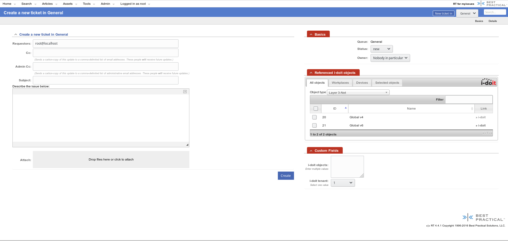
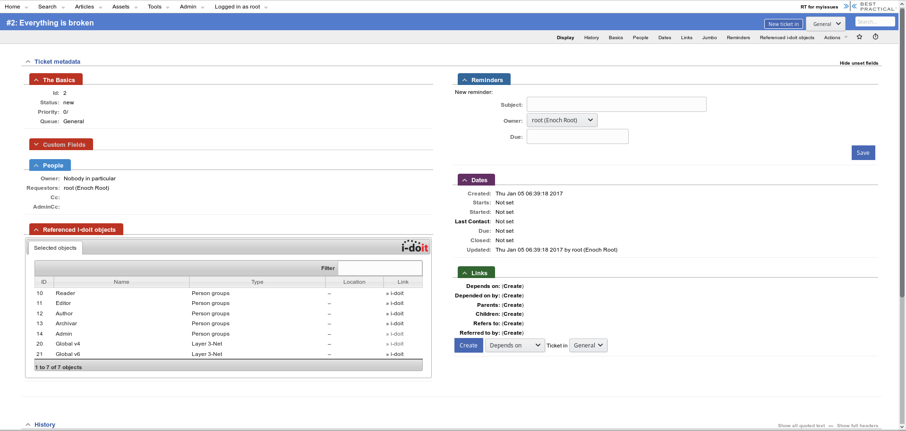
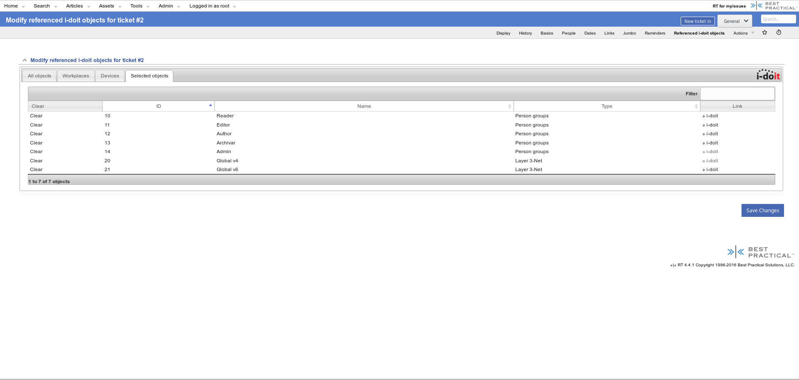
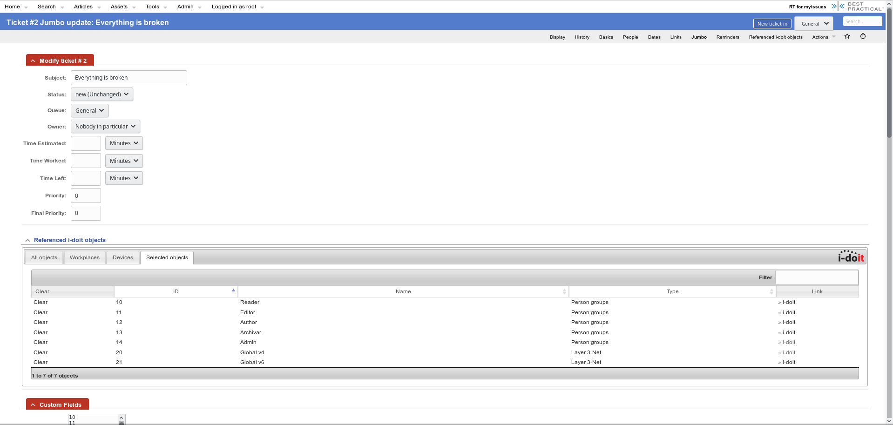

#   RT::Extension::ReferenceIDoitObjects

Create a ticket in relation to one or more i-doit objects

##  Description

This extension gives you the opportunity to combine an issue tracker like [Request Tracker (RT)](https://bestpractical.com/request-tracker) with an IT documentation tool / CMDB like i-doit. It uses i-doit's API to relate a ticket with one or more objects managed by i-doit. On i-doit's side you are able to view all tickets related to an object. This extension also supports i-doit's multi-tenant functionality.

[i-doit ("I document IT")](https://www.i-doit.com/) is a Web application to establish an IT documentation and CMDB. Its core is Free and Open Source Software. Visit <https://www.i-doit.com/> for commercial support and additional services.

##  Requirements

This extension requires RT 4.4.x and i-doit 1.8.2 or higher. It is not compatible with RT != 4.4.x (for example 3.8.x, 4.0.x, 4.2.x) and not compatible with i-doit <= 1.8.1.

Here is a matrix of all compatible versions:

|               | RT 3.8.x  | RT 4.0.x  | RT 4.2.x  | RT 4.4.x  |
| ------------- | --------- | --------- | --------- | --------- |
| i-doit 1.0.x  |           | 0.92¹     |           |           |
| i-doit 1.1.x  |           | 0.92      |           |           |
| i-doit 1.2.x  |           | 0.92      |           |           |
| i-doit 1.3.x  |           |           | 0.93      |           |
| i-doit 1.4.x  |           |           | 0.93/0.94 |           |
| i-doit 1.5.x  |           |           | 0.94      |           |
| i-doit 1.6.x  |           |           | 0.94      |           |
| i-doit 1.7.x  |           |           | 0.94      |           |
| i-doit 1.8.x  |           |           | 0.94      | 1.00²     |

¹ Requires i-doit 1.0.1 or higher

² Requires i-doit 1.8.2 or higher

##  Installation

The prefered way is via CPAN. You may also fetch und install the latest version manually or even try the current development branch.

### Manual

Download the latest version from [CPAN](http://search.cpan.org/dist/RT-Extension-ReferenceIDoitObjects/) or [GitHub](https://github.com/bheisig/rt-extension-referenceidoitobjects/releases). To install this extension run the following commands:

~~~ {.bash}
wget RT-Extension-ReferenceIDoitObjects-1.00.tar.gz
tar xzvf RT-Extension-ReferenceIDoitObjects-1.00.tar.gz
cd RT-Extension-ReferenceIDoitObjects-1.00/
perl Makefile.PL
make
make test
sudo make install
make initdb
~~~

Executing the last command creates 2 new custom fields, so please do it only once. These fields contain the i-doit tenant and the referenced objects.

### CPAN

The prefered and easiest way to install the latest version is via CPAN:

~~~ {.bash}
sudo cpan RT::Extension::ReferenceIDoitObjects
$RT_HOME/sbin/rt-setup-database --action insert --datafile /opt/rt4/local/plugins/RT-Extension-ReferenceIDoitObjects/etc/initialdata
~~~

The second command is equivalent to `make initdb`, but is unfortunately not executed automatically. `$RT_HOME` is the path to your RT installation, for example `/opt/rt4`.

### Git

Fetch the current development branch:

~~~ {.bash}
git clone https://github.com/bheisig/rt-extension-referenceidoitobjects.git
cd rt-extension-referenceidoitobjects
perl Makefile.PL
make
make test
sudo make install
~~~

##  Update

If you already installed this extension you will be able to update to the latest version.

### CPAN

~~~ {.bash}
sudo cpan RT::Extension::ReferenceIDoitObjects
~~~

### Manual

~~~ {.bash}
wget RT-Extension-ReferenceIDoitObjects-1.00.tar.gz
tar xzvf RT-Extension-ReferenceIDoitObjects-1.00.tar.gz
cd RT-Extension-ReferenceIDoitObjects-1.00/
perl Makefile.PL
make
make test
sudo make install
~~~

### Git

Fresh copy:

~~~ {.bash}
git clone https://github.com/bheisig/rt-extension-referenceidoitobjects.git
cd rt-extension-referenceidoitobjects
perl Makefile.PL
make
make test
sudo make install
~~~

Existing copy:

~~~ {.bash}
cd rt-extension-referenceidoitobjects
git pull
perl Makefile.PL
make
make test
sudo make install
~~~

##  Upgrade from Version 0.9x to 1.x

Version 1.x is shipped with several changes, so please follow these instructions carefully.

1.  Just follow the normal update steps.
2.  You have to re-name the custom field "i-doit mandator" to "i-doit tenant".
3.  The custom filed "i-doit tenant" must contain tenant identifiers not their names.
4.  Check RT's site configuration file for the string "mandator". Please replace it with "tenant" (beware of the case-sensitivity).
5.  In RT's site configuration the settings `%IDoitTenantKeys` and `$IDoitDefaultTenant` must containt the tenant identifiers, not their names.
6.  Restart RT environment: `sudo rm -rf $RT_HOME/var/mason_data/obj/* && sudo systemctl restart apache2.service`

##  Configuration

To enable this extension edit the RT site configuration based in `$RT_HOME/etc/RT_SiteConfig.pm`:

~~~ {.perl}
Set(@Plugins,qw(RT::Extension::ReferenceIDoitObjects));

Set($IDoitURL, 'http://example.org/i-doit/');

Set($IDoitAPI, $IDoitURL . '?api=jsonrpc');

Set(%IDoitTenantKeys, (
    1 => 'api key',
    2 => 'api key'
));

Set($IDoitDefaultTenant, 1);

Set($IDoitDefaultView, 'objects'); # 'objects', 'workplaces', 'devices', or 'item'

Set($IDoitInstalledSoftware, 'relations'); # 'objects', or 'relations'

Set($IDoitShowCustomFields, 1); # 1 ('yes') or 0 ('no')
~~~

### `$IDoitURL`

It is _highly recommended_ to establish an TLS encrypted connection between RT and i-doit over a network (HTTPS).

### `$IDoitAPI`

i-doit has a API based on JSON-RPC. If you have not downloaded or activated it yet now it will be a good time to do it.

**Notice:** If you use both Web GUIs of i-doit and RT under different domains (FQDN) or IP addresses, please be aware of browsers' "Same Origin Policy". This extension uses AJAX requests access i-doit's API. If RT and i-doit are not available under the same domain name (or IP address), AJAX calls will fail.

To avoid this "problem" (actually this policy is very useful) you can setup an AJAX proxy. This extension already provides such a proxy located under `etc/i-doit_api_proxy.php`. It is written in PHP, so you have to install PHP 5.4 or higher and the PHP extension `curl` on the same machine where RT is installed:

~~~ {.bash}
sudo apt install php5 php5-curl libapache2-mod-php5
~~~

Make this little script available through your web server and edit the script by setting `$l_url` to the URL of i-doit's API:

~~~ {.php}
$l_url = 'https://i-doit.example.org/i-doit/index.php?api=jsonrpc';
~~~

In RT's site configuration the setting `$IDoitAPI` has to be set to the URL of this script:

~~~ {.perl}
Set($IDoitAPI, 'https://rt.example.org/path/to/i-doit_api_proxy.php');
~~~

If you use a TLS encrypted HTTPS connection with a self-signed certificate `curl` should probably not check the certificate. Add this line to the proxy script:

~~~ {.php}
curl_setopt($l_curl_handle, CURLOPT_SSL_VERIFYPEER, false);
~~~

For testing purposes call the proxy "by hand". Point your browser to the URL of the proxy script. i-doit should answer with an error message that it is not a valid JSON-RPC request.

### `$IDoitTenantKeys`

This is a list of tenants with their API keys. Just put the identifier and API key of every tenant in i-doit you like to relate to tickets.

**Notice:** Within the Web GUI you must configure the custom field "i-doit tenant". Add a new value for each tenant. The important field is `name` where you should set the tenant identifier.

### `$IDoitDefaultTenant`

Choose a default tenant for every situation where it's needed. Use its identifier. This identifier has be to added to the list of the corresponding custom field as well.

### `$IDoitDefaultView`

When creating or editing a ticket, this extension adds a so-called `object browser` to the Web interface. The browser gives you several views on objects:

####    `objects`

Select objects provided by the API and filter them by type.

####    `workplaces`

Select users' workplaces and their related components. Each user will be taken by the email address provided by RT's field "Requestors" if these users are documented in i-doit.

i-doit gives you the possiblity to create relations between users, their workplaces and all components related to these workplaces.

Tip: You may synchronize user information between RT and i-doit via LDAP.

####    `devices`

Select assigned devices for current requestor. Those devices are objects in i-doit which have this requestor as an assigend person.

####    `selected`

View and remove all selected items.

### `$IDoitInstalledSoftware`

Defines which type of objects will be shown for the installed software. There are two options: `objects` or `relations`.

####    `objects`

Shows software objects which are assigned to the currently selected object.

####    `relations`

Shows the software relation between the object and the assigned software.

### `$IDoitShowCustomFields`

Sometimes it is better to "clean up" the Web GUI. Whenever you only have one tenant within i-doit and don't want to edit the object identifiers manually it is recommended to hide the used custom fields. Select `1` to show them or `0` to hide them.

##  Activate Configuration

After all your new configuration will take effect after restarting your RT environment:

~~~ {.bash}
sudo rm -rf $RT_HOME/var/mason_data/obj/*
sudo systemctl restart apache2.service
~~~

This is an example for deleting the mason cache and restarting the Apache HTTP Web server on a Debian GNU/Linux based operating system.

##  Configure i-doit

You may see and create object-related tickets within i-doit. Please refer to the [i-doit Knowledge Base](https://kb.i-doit.com/display/en/) to enable this feature.

If you create a new ticket in i-doit a new browser tab will be opened with the RT user interface. Sometimes RT shows a warning that there is a CSR attack. If you observe this behavior edit RT's local configuration file `$RT_HOME/etc/RT_SiteConfig.pm` where `$RT_HOME` is the path to your RT installation, for example `/opt/rt4`:

~~~ {.perl}
Set($RestrictReferrer, 0); # avoids possible CSR attacks
~~~

Don't forget to clear the Mason cache and restart your Web server.

**Notice:** This setting could breach your security!

##  Usage

Whenever you create a new ticket or edit an existing one you are able to reference this ticket with one or more objects in i-doit. An additional box with the so-called "object browser" will shown up. Just select the objects you need or unselect the objects you do not need.

##  Authors

*   Benjamin Heisig, <bheisig@i-doit.com>
*   Leonard Fischer, <lfischer@i-doit.com>
*   Van Quyen Hoang, <qhoang@i-doit.com>

##  Useful Resources

*   **i-doit Knowledge Base:** <https://kb.i-doit.com/display/en/>
*   **Source code repository:** <https://github.com/bheisig/rt-extension-referenceidoitobjects>
*   **Search CPAN:** <http://search.cpan.org/dist/RT-Extension-ReferenceIDoitObjects/>
*   **MetaCPAN:** <https://metacpan.org/search?q=RT-Extension-ReferenceIDoitObjects>
*   **AnnoCPAN (Annotated CPAN documentation):** <http://annocpan.org/dist/RT-Extension-ReferenceIDoitObjects>
*   **CPAN Ratings:** <https://cpanratings.perl.org/d/RT-Extension-ReferenceIDoitObjects>
*   ~~**CPAN's request tracker:** <https://rt.cpan.org/Public/Dist/Display.html?Name=RT-Extension-ReferenceIDoitObjects>~~ _(unused)_

##  Issues and Contributions

Please report any bugs or feature requests to <https://github.com/bheisig/rt-extension-referenceidoitobjects/issues>. Pull requests are very welcomed!

##  Copyright and License

Copyright (C) 2011-17 synetics GmbH, <https://i-doit.com/>

This program is free software: you can redistribute it and/or modify it under the terms of the GNU Affero General Public License as published by the Free Software Foundation, either version 3 of the License, or (at your option) any later version.

This program is distributed in the hope that it will be useful, but WITHOUT ANY WARRANTY; without even the implied warranty of MERCHANTABILITY or FITNESS FOR A PARTICULAR PURPOSE. See the GNU Affero General Public License for more details.

You should have received a copy of the GNU Affero General Public License along with this program. If not, see <https://www.gnu.org/licenses/>.

Request Tracker (RT) is Copyright Best Practical Solutions, LLC.

